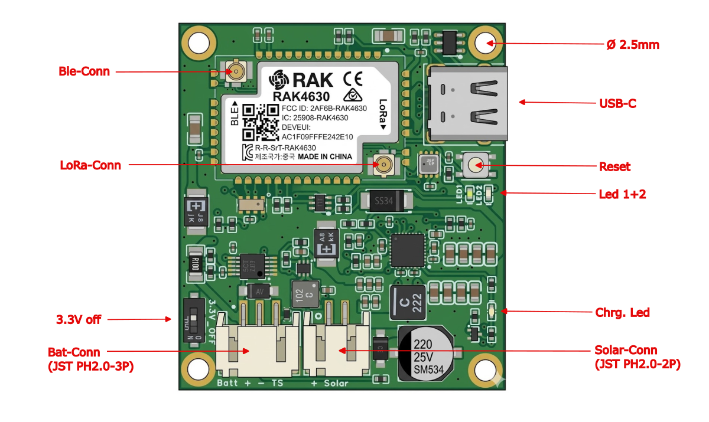
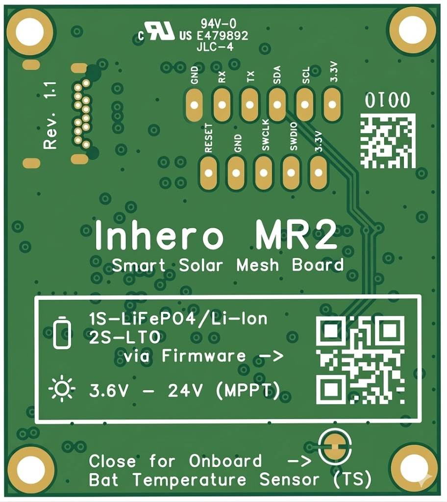
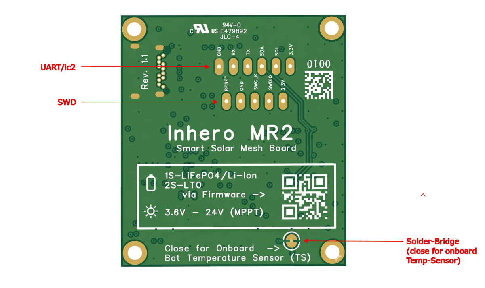

# Inhero MR2 — Datasheet

> **Inhero MR2 – Smart Solar Mesh Board**
> Hardware Revision 1.1

> 🇩🇪 [Deutsche Version](de/DATASHEET.md)

---

## Board Overview

The Inhero MR2 is a LoRa mesh repeater board based on the **RAK4630** module (nRF52840 + SX1262) with integrated smart solar charging, power monitoring, and low-voltage protection. Supported battery configurations are 1S Li-Ion, 1S LiFePO4, and 2S LTO. The board was specifically designed for autonomous long-term deployment at remote or hard-to-reach locations. In Central Europe, uninterrupted continuous repeater operation is possible with unshaded solar panels ≥ 1 W and battery capacities ≥ 9 Ah.

The charge and discharge cutoff voltages (see table [Supported Battery Chemistries](#supported-battery-chemistries)) are chosen to avoid excessive stress on the batteries during summer while ensuring that sleep mode can be reliably initiated when energy is low.

In low-voltage sleep, current consumption is < 500 µA. Once the battery voltage has risen above the respective low-V wake threshold (see table [Supported Battery Chemistries](#supported-battery-chemistries)) through solar charging, the board boots normally. The 200 mV hysteresis between sleep and wake thresholds prevents motorboating – an uncontrolled, rapid on/off cycling of the system that would occur if the sleep and wake thresholds were too close together.

### Safety & Protection Features

| Feature | Description |
|---------|-------------|
| **Watchdog Timer (WDT)** | nRF52840 hardware watchdog. Automatically reboots the board if the firmware hangs – essential for unattended long-term operation. |
| **Low-Voltage Protection** | INA228 ALERT interrupt on chemistry-specific threshold → controlled system-off with RTC wake. Solar charging remains active during sleep (CE pin latched). |
| **Charger requires active firmware** | The BQ25798 only charges when the firmware is actively running. Without flashed firmware or with the 3.3V off switch engaged, charging remains disabled. The nRF52840 must be able to monitor the charger at all times as host. |
| **JEITA Temperature Protection** | Temperature-dependent charge current reduction via the NTC sensor (TS pin). Frost charge protection configurable via `set board.fmax`. JEITA is disabled for LTO. The Inhero voltage divider (RT1=5.6 kΩ, RT2=27 kΩ) shifts TS thresholds lower than TI reference (~5–6 °C in cold range, ~2–3 °C in warm/hot range). WARM zone configured to start at ~52 °C (register: 55 °C), effectively neutralized (VREG + ICHG unchanged in WARM), auto battery discharge disabled — see README for details. |

### Solar Power Management

| Feature | Description |
|---------|-------------|
| **MPPT (Maximum Power Point Tracking)** | The BQ25798 optimizes solar harvesting via MPPT (VOC_PCT = 81.25%, matched for crystalline silicon solar cells). Automatic recovery on power-good loss and stuck-PGOOD detection with HIZ toggle. |
| **PFM Forward Mode** | Permanently enabled – improves efficiency at low solar currents. |

### Specifications

| Parameter | Value |
|---|---|
| **MCU** | nRF52840 (ARM Cortex-M4, 64 MHz) |
| **Radio** | Semtech SX1262 (via RAK4630) |
| **Frequency** | LoRa Sub-GHz (region-dependent) |
| **Connectivity** | LoRa, BLE 5.0, USB-C |
| **Supply Voltage** | 1S Li-Ion / 1S LiFePO4 / 2S LTO (via firmware config) |
| **Solar Input** | 3.6 V – 24 V (MPPT) |
| **Max. Solar Voc** | 25 V |
| **USB Charging** | 5 V via USB-C (SS34 diode to VBUS-BQ, same charger path as solar) |
| **Charger** | BQ25798 (MPPT, JEITA) |
| **Max. Charge Current** | 50 – 1500 mA (configurable) |
| **Power Monitor** | INA228 (Coulomb Counter, ALERT) |
| **RTC** | RV-3028-C7 (time base / wake-up timer) |
| **Buck Converter** | TPS62840 (3.3 V rail, max. 750 mA) |
| **System-Off Current** | via 3.3V off switch ~15 µA |
| **System Sleep Current** | < 500 µA (firmware sleep with GPIO latch, CE active, RTC wake) |
| **PCB Size** | 45 × 40 mm |
| **Mounting Holes** | 4× M2.5, hole spacing 40 × 35 mm |
| **Operating Temperature** | –40 °C to +85 °C (MCU spec) |
| **Bootloader** | Adafruit nRF52 OTA-Fix Bootloader (factory-installed), UF2-capable |

---

## PCB – Front Side (Component Side)

### Connectors, Buttons & LEDs – Front Side

| Label (→ image) | Name | Description |
|-----------------|------|-------------|
| **Ble-Conn** | U.FL – BLE | Antenna connector for Bluetooth Low Energy (top left on RAK4630) |
| **LoRa-Conn** | U.FL – LoRa | Antenna connector for LoRa Sub-GHz (left center on RAK4630) |
| **USB-C** | USB-C Port | USB interface for power supply, charging, firmware flashing and CLI access (top right). CC1/CC2 pulled to GND via 4.7 kΩ (USB sink). VBUS-USB is connected to VBUS-BQ (solar input) via SS34 Schottky diode — USB power feeds the same charger input as the solar panel. |
| **Reset** | Reset Button | Single click: reset the nRF52840. Double click: enter USB mass storage mode for UF2 firmware updates (right side, below USB-C) |
| **Led 1+2** | Status LEDs | LED1 + LED2 = RAK4630 user LEDs (heartbeat / boot indicator, right side, stacked) |
| **Chrg. Led** | Charge LED | BQ25798 STAT output – indicates charge status (bottom right, next to solar connector) |
| **3.3V off** | Power Switch | Slide switch to disconnect the 3.3 V supply (bottom left). **⚠ Caution: Inverted logic!** Switch position "ON" = EN pin low = board **off**. Switch position "OFF" = EN pin high = board **on**. |
| **Bat-Conn** (JST PH2.0-3P) | Battery Connector | 3-pin JST PH2.0 connector: **Batt+**, **Batt−**, **TS** (bottom left) |
| **Solar-Conn** (JST PH2.0-2P) | Solar Connector | 2-pin JST PH2.0 connector: **Solar+**, **Solar−** (bottom right) |
| **Ø 2.5mm** | Mounting Holes | 4× M2.5 mounting holes in the corners |

### Key Components – Front Side

| Component | Name | Description |
|-----------|------|-------------|
| **RAK4630** | Core Module | nRF52840 SoC + SX1262 LoRa transceiver (center, shielded) |
| **BME280** | Environmental Sensor | Temperature, humidity, pressure |
| **BQ25798** | Battery Charger | MPPT, JEITA temperature protection, 15-bit ADC |
| **INA228** | Power Monitor | Coulomb counter with ALERT interrupt |
| **TPS62840** | Buck Converter | DC/DC, 750 mA, EN switched via 3.3V off switch |

### Pinout – Battery Connector (JST PH2.0-3P, left to right)

| Pin | Signal | Description |
|-----|--------|-------------|
| 1 | **Batt +** | Battery positive terminal |
| 2 | **Batt −** | Battery negative terminal (GND) |
| 3 | **TS** | Temperature sensor (NTC) for JEITA charge protection. Required type: NCP15XH103F03RC (10 kΩ @ 25 °C, Beta 3380) or compatible |

### Pinout – Solar Connector (JST PH2.0-2P, left to right)

| Pin | Signal | Description |
|-----|--------|-------------|
| 1 | **Solar +** | Solar panel positive (3.6 V – 24 V, max. Voc 25 V) |
| 2 | **Solar −** | Solar panel negative (GND) |

### USB Charging Path

USB-C VBUS is connected to the BQ25798 VBUS input (same single input as solar) via an **SS34 Schottky diode**. The BQ25798 has only one VBUS input and does not distinguish between USB and solar. CC1 and CC2 are pulled to GND via 4.7 kΩ resistors, advertising the board as a USB power sink (5 V default). The SS34 diode prevents backflow from the solar panel to the USB bus, but current **can** flow from USB-VBUS out through the solar connector.

> **⚠ Warning:** Since VBUS-USB and VBUS-BQ (solar input) are connected via the SS34 diode, a **short circuit on the solar connector** will also short VBUS-USB. Never short-circuit the solar input while USB is connected.

---

## PCB – Back Side

### Headers & Pads – Back Side

#### UART/I2C – Header Row 1 (top row, castellated pads)

| Pin | Signal | Description |
|-----|--------|-------------|
| 1 | **GND** | Ground |
| 2 | **RX** | UART Receive |
| 3 | **TX** | UART Transmit |
| 4 | **SDA** | I2C Data |
| 5 | **SCL** | I2C Clock |
| 6 | **3.3V** | 3.3 V output (max. 500 mA, shared with board consumption) |

#### SWD – Header Row 2 (bottom row, castellated pads)

| Pin | Signal | Description |
|-----|--------|-------------|
| 1 | **RESET** | nRF52840 Reset |
| 2 | **GND** | Ground |
| 3 | **SWCLK** | SWD Clock (debug interface) |
| 4 | **SWDIO** | SWD Data (debug interface) |
| 5 | **3.3V** | 3.3 V output (max. 500 mA, shared with board consumption) |

#### Solder Bridge – Onboard Temperature Sensor (bottom right)

| Label (→ image) | Description |
|-----------------|-------------|
| **Solder-Bridge** (close for onboard Temp-Sensor) | Solder bridge for the onboard NTC temperature sensor (NCP15XH103F03RC, 10 kΩ @ 25 °C, Beta 3380). **Closed** = onboard NTC active. **Open** = external NTC of type NCP15XH103F03RC (10 kΩ @ 25 °C, Beta 3380) or compatible required via TS pin on the battery connector. |

---

## I2C Bus – Address Map

| Address | Component | Function |
|---------|-----------|----------|
| 0x40 | INA228 | Power Monitor / Coulomb Counter |
| 0x52 | RV-3028-C7 | Real-Time Clock (RTC) |
| 0x6B | BQ25798 | Battery Charger (MPPT, JEITA) |
| 0x76/0x77 | BME280 | Environmental Sensor (T, H, P) |

---

## Pin Assignment (Key GPIOs)

| GPIO | nRF52840 Pin | Function |
|------|-------------|----------|
| P0.04 | WB_IO4 | BQ CE pin (via DMN2004TK-7 N-FET, inverted) |
| P1.02 | — | INA228 ALERT (low-voltage interrupt) |
| GPIO17 | WB_IO1 | RV-3028 RTC interrupt |
| GPIO21 | — | BQ25798 INT |

---

## Supported Battery Chemistries

| Type | Nominal Voltage | Charge Voltage | Low-V Sleep | Low-V Wake | Hysteresis |
|------|----------------|----------------|-------------|------------|------------|
| **Li-Ion 1S** | 3.7 V | 4.2 V | 3100 mV | 3300 mV | 200 mV |
| **LiFePO4 1S** | 3.2 V | 3.6 V | 2700 mV | 2900 mV | 200 mV |
| **LTO 2S** | 4.6 V (2× 2.3 V) | 5.6 V | 3900 mV | 4100 mV | 200 mV |
| **none** | — | — | — | — | — |

---

## Firmware Environments

| Build Target | Description |
|---|---|
| `Inhero_MR2_repeater` | Standard repeater |
| `Inhero_MR2_repeater_bridge_rs232` | Repeater with RS232 bridge (Serial2 on P0.19/P0.20) |
| `Inhero_MR2_room_server` | Room Server |
| `Inhero_MR2_companion_radio_usb` | Companion Radio (USB, extra filesystem) |
| `Inhero_MR2_terminal_chat` | Terminal Chat |
| `Inhero_MR2_sensor` | Sensor firmware |
| `Inhero_MR2_kiss_modem` | KISS Modem |

---

## Absolute Maximum Ratings

| Parameter | Min | Max | Unit |
|---|---|---|---|
| Solar input voltage (Voc) | — | 25 | V |
| Charge current (configurable) | 50 | 1500 | mA |
| Shunt current (INA228, 100 mΩ) | — | 1600 | mA |
| Ambient temperature (operating) | –40 | +85 | °C |

---

## See Also

- [README.md](README.md) – Overview, feature matrix and diagnostics
- [QUICK_START.md](QUICK_START.md) – Quick start for commissioning and CLI setup
- [CLI_CHEAT_SHEET.md](CLI_CHEAT_SHEET.md) – All board-specific CLI commands at a glance
- [IMPLEMENTATION_SUMMARY.md](IMPLEMENTATION_SUMMARY.md) – Complete technical documentation
