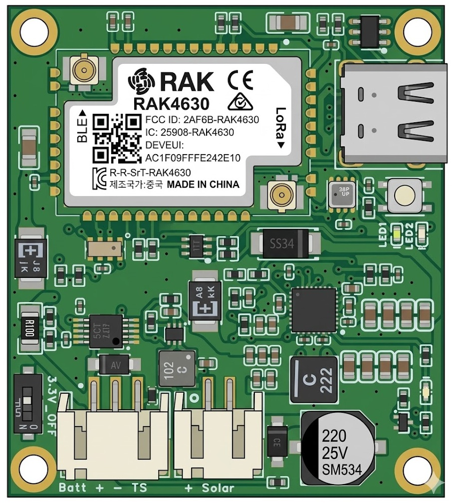

# Inhero MR-2



> 🇩🇪 [Deutsche Version](de/README.md)

## Table of Contents

- [Overview](#overview)
- [Current Feature Matrix](#current-feature-matrix)
- [Power Management Features](#power-management-features)
- [Firmware Build](#firmware-build)
- [CLI Commands](#cli-commands)
- [Diagnostics & Troubleshooting](#diagnostics--troubleshooting)
- [See Also](#see-also)

## Overview

The Inhero MR-2 is the second generation mesh repeater with improved power management.

**Hardware Version:** Rev 1.1  
**Key Features:**
- INA228 Power Monitor with Coulomb Counter + ALERT interrupt on P1.02
- RV-3028-C7 RTC for wake-up management
- TPS62840 Buck Converter (EN via 3.3V_off switch)
- BQ25798 Battery Charger with MPPT
- BQ CE pin (P0.04/WB_IO4) via DMN2004TK-7 N-FET (inverted logic: HIGH=charging on)
- USB-C charging via SS34 Schottky diode to BQ25798 VBUS input (same input as solar)

## Current Feature Matrix

| Feature | Status | Notes |
|---------|--------|-------|
| INA228 ALERT → Low-Voltage System Sleep | Active | ISR on P1.02 → Task Notification → System Sleep with GPIO latch + RTC Wake |
| RTC Wakeup (Low-Voltage Recovery) | Active | 60 min (periodic) |
| BQ CE Pin Safety (FET-inverted) | Active | GPIO HIGH → FET ON → CE LOW → charge ON (BQ25798 CE active-low), Dual-Layer: GPIO + I2C |
| System Sleep with latched CE | Active | < 500µA, GPIO4 latch preserved HIGH → FET ON → CE LOW → solar charging possible |
| SOC 0% after Low-Voltage Recovery | Active | SOC initialized to 0% on recovery, auto-sync on "Charging Done" |
| SOC via INA228 + manual battery capacity | Active | `set board.batcap` available |
| SOC→Li-Ion mV Mapping (workaround) | Active | Will be removed when MeshCore transmits SOC% natively |
| MPPT Recovery + Stuck-PGOOD Handling | Active | Cooldown logic active |
| PFM Forward Mode | Permanently active | Always enabled (improves efficiency at low solar currents) |

## Power Management Features

### Low-Voltage Handling (Flag/Tick Architecture)

1. **INA228 ALERT** fires at `lowv_sleep_mv` (hardware interrupt on P1.02)
2. **ISR** sets `lowVoltageAlertFired = true` (volatile flag only, no FreeRTOS call)
3. **`tickPeriodic()`** (main loop, next `tick()`) checks flag → shutdown:
   - CE pin → HIGH (FET ON → CE LOW → charging active)
   - P0.04 excluded from `disconnectLeakyPullups()` → GPIO latch preserved in sleep
   - RTC wake configured (`LOW_VOLTAGE_SLEEP_MINUTES` = 60 min)
   - SOC set to 0%
   - `sd_power_system_off()` → **System Sleep with GPIO latch** (< 500µA)
4. **RTC Wake** (hourly) → system boots, early-boot checks VBAT:
   - Below `lowv_wake_mv` → immediately back to System Sleep (CE remains latched LOW)
   - Above `lowv_wake_mv` → normal boot, SOC starts at 0%

> **Note**: All I2C operations (MPPT, SOC, Hourly Stats) run in main loop context
> via `tickPeriodic()` — no FreeRTOS tasks for I2C, no mutex needed.

### BQ CE Pin (Rev 1.1 — FET-inverted)
- **DMN2004TK-7 N-FET**: Gate ← GPIO4 (ext. pull-down), Drain → CE, Source → GND
- **GPIO HIGH** → FET ON → CE LOW → **charging ON** (BQ25798 CE active-low)
- **GPIO LOW / High-Z** → ext. pull-down on gate → FET OFF → pull-up on CE → CE HIGH → **charging OFF**
- **System Sleep**: GPIO4 latch preserved HIGH (excluded from `disconnectLeakyPullups()`) → FET ON → CE LOW → **solar charging active**
- **Safety default**: RAK unpowered/unflashed → pull-down on gate → FET OFF → CE HIGH → **charging disabled**
- **Dual-Layer**: CE pin (hardware FET) + `setChargeEnable()` (I2C register)

### Voltage Thresholds (all chemistries)

| Chemistry | lowv_sleep_mv | lowv_wake_mv | Hysteresis |
|-----------|--------------|-------------|------------|
| Li-Ion 1S | 3100 | 3300 | 200mV |
| LiFePO4 1S | 2700 | 2900 | 200mV |
| LTO 2S | 3900 | 4100 | 200mV |

- **lowv_sleep_mv**: INA228 ALERT threshold → triggers System Sleep with GPIO latch
- **lowv_wake_mv**: RTC wake threshold → boot only when VBAT is above, also 0% SOC marker

### System Sleep Power Consumption
- **< 500µA** total consumption (nRF52840 System-Off + RTC + quiescent currents of all components)
- GPIO4 latch preserved HIGH → FET ON → CE LOW → solar charging active

### Coulomb Counter & SOC Tracking
- **Real-time SOC tracking** via INA228 (±0.1% accuracy)
- **100mΩ shunt resistor** (1.6A max current)
- **200mV uniform hysteresis** for all chemistries (lowv_sleep_mv → lowv_wake_mv)
- **Manual capacity:** `set board.batcap` for fixed capacity

### SOC→Li-Ion mV Mapping (Workaround)
- **Problem**: MeshCore only transmits `getBattMilliVolts()`, not SOC%. The Companion App uses a Li-Ion curve for SOC calculation — incorrect display for LiFePO4/LTO.
- **Solution**: When valid coulomb-counting SOC is available, an equivalent Li-Ion 1S OCV (3000–4200 mV) is returned, so the app displays the correct SOC%.
- **TODO**: Remove once MeshCore supports native SOC% transmission.

### Time-To-Live (TTL) Prediction
- **Time base:** 7-day moving average (`avg_7day_daily_net_mah`) of daily net energy consumption
- **Data source:** 168-hour ring buffer (7 days) with hourly INA228 coulomb counter samples (charged/discharged/solar mAh)
- **Formula:** `TTL_hours = (SOC% × capacity_mah / 100) / |avg_7day_daily_net_mah| × 24`
- **Prerequisites:** `living_on_battery == true` (24h deficit), min. 24h data, capacity known
- **TTL = 0:** Solar surplus, no 24h data available, or capacity unknown
- **CLI:** TTL is shown in `get board.stats` (BAT mode only, e.g. `T:12d0h`)
- **Telemetry:** Transmitted as days via CayenneLPP Distance field (max. 990 days for "infinite")

### Solar Power Management 🆕

- **Solar current display:** The BQ25798 IBUS ADC is inaccurate at low currents (~±30mA error). Therefore solar current is displayed in steps:
  - `0mA` — ADC reports exactly 0 (no solar current)
  - `<50mA` — 1–49mA (ADC unreliable in this range)
  - `~72mA` — 50–100mA with rounding symbol `~` (limited accuracy)
  - `385mA` — >100mA without rounding symbol (sufficiently accurate)
  - Always integer without decimal places (no pseudo-precision)
- **PFM Forward Mode:** Permanently enabled. Improves efficiency at low currents.
- **MPPT VOC_PCT 81.25%:** The BQ25798 MPPT is configured to VOC_PCT=81.25% (instead of chip default 87.5% or former 75%). This value matches the typical Vmp/Voc ratio of crystalline silicon solar cells (~80-83%).
- **MPPT Recovery:** Re-enables MPPT on PowerGood=1 (readback check: only on actual change)
- **BQ INT pin not used:** No interrupt — pure polling every 60s in `runMpptCycle()`
- **Error monitoring:** Diagnostic commands show FAULT_STATUS registers (0x20, 0x21) for detailed analysis incl. VBAT_OVP, VBUS_OVP and temperature conditions
- **VREG display:** Shows the actually configured battery regulation voltage in diagnostics for threshold verification

## Firmware Build

```bash
# Repeater (default)
platformio run -e Inhero_MR2_repeater

# Repeater with RS232 bridge (Serial2 on P0.19/P0.20)
platformio run -e Inhero_MR2_repeater_bridge_rs232

# Room Server
platformio run -e Inhero_MR2_room_server

# Companion Radio (USB, with extra filesystem)
platformio run -e Inhero_MR2_companion_radio_usb

# Terminal Chat
platformio run -e Inhero_MR2_terminal_chat

# Sensor
platformio run -e Inhero_MR2_sensor

# KISS Modem
platformio run -e Inhero_MR2_kiss_modem
```

## CLI Commands

### Get Commands
```bash
get board.bat       # Query current battery type
                    # Output: liion1s | lifepo1s | lto2s | none

get board.fmax      # Query frost charge behavior
                    # Output: 0% | 20% | 40% | 100%
                    # Value = max charge current in T-Cool range (0°C to -5°C),
                    # relative to board.imax
                    # 40% at imax=500mA → max. 200mA charge current at 0°C to -5°C
                    # 0% = charging blocked in T-Cool range
                    # 100% = no reduction (full current even in cold)
                    # Below -5°C (T-Cold): charging always completely blocked (JEITA)
                    # Note: Only charging is restricted. With sufficient
                    # solar, the board continues to run on solar power —
                    # the battery is neither charged nor discharged.
                    # LTO batteries: N/A (JEITA disabled, charges even in frost)

get board.imax      # Query maximum charge current
                    # Output: <current>mA (e.g. 200mA)

get board.mppt      # Query MPPT status
                    # Output: MPPT=1 (enabled) | MPPT=0 (disabled)

get board.telem     # Query real-time telemetry with SOC 🆕
                    # Output: B:<V>V/<I>mA/<T>C SOC:<percent>% S:<V>V/<solar current>
                    # Examples:
                    #   B:3.85V/125.4mA/22C SOC:68.5% S:5.12V/385mA      (>100mA: accurate)
                    #   B:3.85V/-8.2mA/18C SOC:72.0% S:4.90V/~72mA      (50-100mA: ~estimate)
                    #   B:3.30V/-45.0mA/5C SOC:40.1% S:0.00V/<50mA      (<50mA: ADC inaccurate)
                    # Components:
                    # - B: Battery (Voltage/Current/Temperature/SOC)
                    # - S: Solar (Voltage/Current — accuracy depends on BQ25798 IBUS ADC)

get board.stats     # Query energy statistics (balance + MPPT) 🆕
                    # Output: <24h>/<3d>/<7d>mAh C:<24h> D:<24h> 3C:<3d> 3D:<3d> 7C:<7d> 7D:<7d> <SOL|BAT> M:<mppt>% T:<ttl>
                    # Example: +125/+45/+38mAh C:200 D:75 3C:150 3D:105 7C:140 7D:102 SOL M:85% T:N/A
                    # Example: -30/-45/-40mAh C:10 D:40 3C:5 3D:50 7C:8 7D:48 BAT M:45% T:72h
                    # Components:
                    # - +125: Last 24h net balance (charge - discharge) in mAh
                    # - +45: 3-day average net balance in mAh
                    # - +38: 7-day average net balance in mAh
                    # - C/D: Charged/Discharged mAh (24h)
                    # - 3C/3D: 3-day average charged/discharged mAh
                    # - 7C/7D: 7-day average charged/discharged mAh
                    # - SOL: Running on solar (self-sufficient)
                    # - BAT: Living on battery (deficit mode)
                    # - M:85%: MPPT enabled percentage (7-day average)
                    # - T:72h: Time To Live (only shown if BAT mode, 7d-avg basis)
                    #   Format: T:12d5h (≥24h) or T:72h (<24h) or T:N/A

get board.cinfo     # Charger info + last PG-stuck HIZ toggle
                    # Output: <state> + flags
                    # States: !CHG, PRE, CC, CV, TRICKLE, TOP, DONE

get board.conf      # Query all configuration values
                    # Output: B:<bat> F:<fmax> M:<mppt> I:<imax> Vco:<voltage> V0:<0%SOC>

get board.batcap    # Query battery capacity
                    # Output: <capacity> mAh (set) or <capacity> mAh (default)
                    # Shows whether capacity was manually set or chemistry default

get board.tccal     # Query NTC temperature calibration offset
                    # Output: TC offset: <+/-offset> C (0.00=default)

get board.leds      # Query LED enable status
                    # Output: "LEDs: ON (Heartbeat + BQ Stat)" or "LEDs: OFF (Heartbeat + BQ Stat)"
                    # Shows whether heartbeat LED and BQ25798 stat LED are enabled
```

### Set Commands
```bash
set board.bat <type>           # Set battery type
                               # Options: lto2s | lifepo1s | liion1s | none
                               # none = no battery / unknown (charging disabled)

set board.fmax <behavior>      # Set frost charge behavior
                               # Options: 0% | 20% | 40% | 100%
                               # Limits charge current in T-Cool range (0°C to -5°C)
                               # to X% of board.imax
                               # 0% = charging blocked in T-Cool range
                               # 20% = max. 20% of imax at 0°C to -5°C
                               # 40% = max. 40% of imax at 0°C to -5°C
                               # 100% = no reduction
                               # Below -5°C (T-Cold): charging always blocked (JEITA)
                               # Note: Only charging is restricted. With sufficient
                               # solar, the board continues to run on solar power —
                               # the battery is neither charged nor discharged.
                               # N/A for LTO batteries (JEITA disabled)

set board.imax <current>       # Set maximum charge current in mA
                               # Range: 50-1500mA (BQ25798 minimum: 50mA)

set board.mppt <1|0>           # Enable/disable MPPT
                               # 1 = enabled, 0 = disabled

set board.batcap <capacity>    # Set battery capacity in mAh
                               # Range: 100-100000 mAh
                               # Used for accurate SOC calculation

set board.tccal                # Calibrate NTC temperature
                               # Two modes:
                               # 1) set board.tccal         → auto-calibration via BME280
                               #    Output: TC auto-cal: BME=<temp> offset=<+/-offset> C
                               # 2) set board.tccal reset   → reset offset to 0.00
                               #    Output: TC calibration reset to 0.00 (default)

set board.leds <on|off>        # Enable/disable heartbeat + BQ stat LED
                               # on/1 = enable, off/0 = disable
                               # Boot LEDs (3 blue blinks) always active

set board.soc <percent>        # Manually set SOC
                               # Range: 0-100
                               # Note: INA228 must be initialized
```

## Diagnostics & Troubleshooting

### BQ25798 Register Verification
The diagnostic functions enable precise verification of BQ25798 registers against the datasheet:

**Key Registers:**
- **0x0F (CHARGER_CONTROL_0)**: EN_CHG (Bit 5)
- **0x15 (MPPT_CONTROL)**: EN_MPPT (Bit 0), VOC_PCT (Bits 7-5), VOC_DLY (Bits 4-3), VOC_RATE (Bits 2-1)
- **0x1B (CHARGER_STATUS_0)**: PG_STAT (Bit 3), VINDPM (Bit 6), IINDPM (Bit 7)
- **0x1C (CHARGER_STATUS_1)**: CHG_STAT (Bits 7-5), VBUS_STAT (Bits 4-1)
- **0x1F (CHARGER_STATUS_4)**: Temperature status (Bits 3-0)

**Known Issues:**
1. **MPPT disabled**: BQ25798 automatically sets MPPT=0 when PG=0
   - Solution: `checkAndFixSolarLogic()` re-enables MPPT on PG=1
2. **PG stuck at sunrise**: VBUS rises slowly, BQ fails to qualify the source
   - Solution: `checkAndFixSolarLogic()` toggles HIZ when VBUS ≥ 4.5V + PG=0 (5min cooldown)

## See Also

- [QUICK_START.md](QUICK_START.md) - Quick start for commissioning and CLI setup
- [CLI_CHEAT_SHEET.md](CLI_CHEAT_SHEET.md) - All board-specific CLI commands at a glance
- [IMPLEMENTATION_SUMMARY.md](IMPLEMENTATION_SUMMARY.md) - Complete technical documentation
