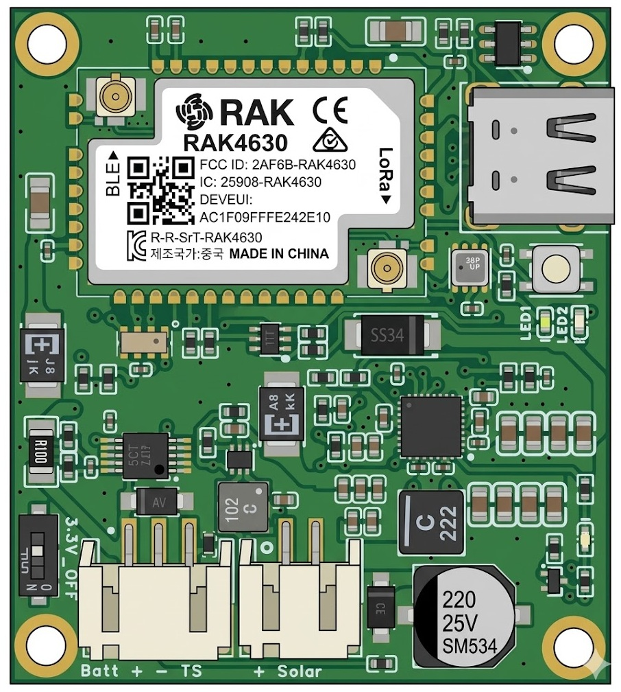
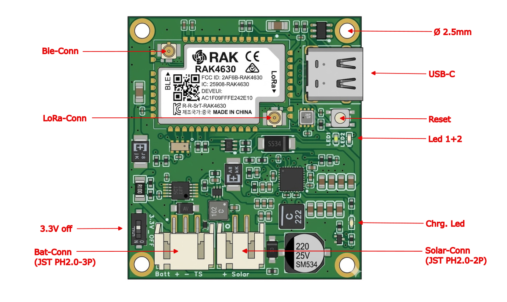
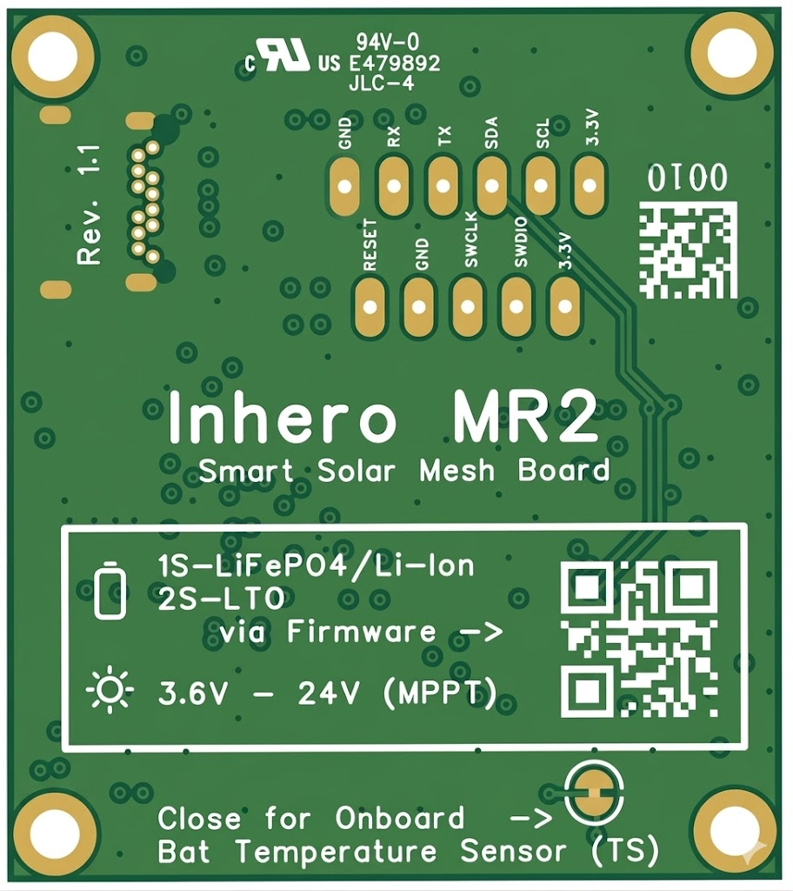
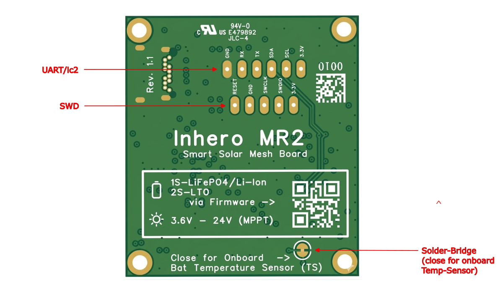

# Inhero MR2 — Datenblatt

> **Inhero MR2 – Smart Solar Mesh Board**
> Hardware-Revision 1.1

> 🇬🇧 [English Version](../DATASHEET.md)

---

## Board-Übersicht

Das Inhero MR2 ist ein LoRa-Mesh-Repeater-Board auf Basis des **RAK4630(H)**-Moduls (nRF52840 + SX1262, Hochband-Variante — siehe [LoRa-Frequenzbänder](#lora-frequenzbänder)) mit integriertem intelligentem Solar-Laderegler, Leistungsüberwachung und Tiefentladeschutz. Unterstützte Akku-Konfigurationen sind 1S-Li-ion, 1S-LiFePO4, 2S-LTO und 1S-Na-ion. Das Board wurde speziell für den autarken Langzeiteinsatz an abgelegenen oder schwer erreichbaren Standorten entwickelt. In Mitteleuropa ist ein ununterbrochener Repeater-Dauerbetrieb mit unverschatteten Solarmodulen ≥ 1 W und Akkukapazitäten ≥ 9 Ah möglich.

Die Lade- und Entladeschlussspannungen (siehe Tabelle [Unterstützte Akkuchemien](#unterstützte-akkuchemien)) sind so gewählt, dass die Akkus im Sommer nicht übermäßig belastet werden und gleichzeitig der Sleep-Betrieb bei Energiemangel sicher eingeleitet werden kann.

Im Low-Voltage-Sleep beträgt die Stromaufnahme < 500 µA. Sobald die Akkuspannung durch Solarladung wieder über die jeweilige Low-V-Wake-Schwelle (siehe Tabelle [Unterstützte Akkuchemien](#unterstützte-akkuchemien)) gestiegen ist, bootet das Board normal. Die 200 mV Hysterese zwischen Sleep- und Wake-Schwelle verhindert Motorboating – ein unkontrolliertes, schnelles Ein- und Ausschalten des Systems, das auftreten würde, wenn Sleep- und Wake-Schwelle zu dicht beieinander lägen.

### Sicherheits- und Schutzfunktionen

| Feature | Beschreibung |
|---------|-------------|
| **Watchdog Timer (WDT)** | Hardware-Watchdog des nRF52840. Startet das Board automatisch neu, wenn die Firmware hängt – wichtig für den unbeaufsichtigten Dauerbetrieb. |
| **Low-Voltage-Protection** | INA228 ALERT-Interrupt bei Unterschreitung der chemie-spezifischen Schwelle → kontrollierter System Sleep mit RTC-Wake. Solarladung bleibt im Sleep aktiv (CE-Pin latched). |
| **Laderegler nur bei aktiver Firmware** | Der BQ25798 lädt ausschließlich, wenn die Firmware aktiv läuft. Ohne geflashte Firmware oder bei ausgeschaltetem „3.3V off“-Schalter bleibt die Ladung deaktiviert. Der nRF52840 muss als Host den Laderegler jederzeit überwachen können. |
| **JEITA-Temperaturschutz** | Temperaturabhängige Ladestromreduktion über den NTC-Sensor (TS-Pin). Frostladeschutz konfigurierbar per `set board.fmax`. LTO und Na-ion brauchen keine JEITA-Überwachung und laufen mit abgeschaltetem Temperaturschutz. Der Inhero-Spannungsteiler (RT1=5,6 kΩ, RT2=27 kΩ) verschiebt TS-Schwellen nach unten ggü. TI-Referenz (~2–3 °C; effektiver T-Cool-Bereich ca. −2 °C bis +3 °C, siehe JEITA-Tabelle im README). WARM-Zone konfiguriert auf Start bei ~52 °C (Register: 55 °C), effektiv neutralisiert (VREG + ICHG unverändert in WARM), automatische Akkuentladung deaktiviert — siehe [README.md — JEITA](README.md#jeita-temperaturzonen-konfiguration) für Details. **Hinweis:** Die JEITA-Schwellen werden vom BQ25798 direkt in Hardware ausgewertet. Die `set board.tccal`-Kalibrierung korrigiert nur die CLI-/Telemetrie-Temperaturanzeige und beeinflusst das JEITA-Verhalten nicht — siehe [FAQ #12](FAQ.md#12-wann-sollte-ich-set-boardtccal-ausführen). |
| **JEITA-Override** | `set board.jeitaignore 1` setzt das TS_IGNORE-Bit des BQ25798, sodass auch unterhalb der T-Cold-Schwelle (≈ −2 °C) weitergeladen wird. Standardmäßig aus. Akzeptiert für Li-ion 1S und LiFePO4 1S; wirksam nur, solange `board.batcap` gesetzt wurde und `board.imax` höchstens 0,05C dieser Kapazität beträgt. Mit gesetztem TS_IGNORE entfällt auch die Ladesperre bei T-Hot (≈ +57,7 °C). Das Laden von Li-ion oder LiFePO4 bei Frost erfolgt auf eigenes Risiko des Betreibers und ist auf mitteleuropäischen Frost ausgelegt; Standorte regelmäßig unter −20 °C verlangen LTO oder Na-ion. Siehe [BATTERY_GUIDE.md](BATTERY_GUIDE.md). |

> **⚠ WARNUNG — Kein Verpolschutz:** Das Board verfügt über **keinen Hardware-Verpolschutz** an Akku- oder Solareingang. Ein verpolter Anschluss führt zu **sofortiger, irreversibler Beschädigung** des Boards. Vor dem Anschließen immer die Polarität prüfen.

### Solar-Energiemanagement

| Feature | Beschreibung |
|---------|-------------|
| **MPPT (Maximum Power Point Tracking)** | Der BQ25798 optimiert die Solarernte per MPPT (VOC_PCT = 81,25 %, passend für kristalline Silizium-Solarzellen). Automatische Recovery bei Power-Good-Verlust und Stuck-PGOOD-Erkennung mit HIZ-Toggle. |
| **PFM Forward Mode** | Ab Werk im BQ25798 aktiv (PFM_FWD_DIS=0, REG0x12); die Firmware ändert ihn nicht. Verbessert die Effizienz bei niedrigen Solarströmen. |

### Technische Daten

| Parameter | Wert |
|---|---|
| **MCU** | nRF52840 (ARM Cortex-M4, 64 MHz) |
| **Funk** | Semtech SX1262 (via RAK4630**(H)**, Hochband-Variante des Moduls) |
| **Frequenz** | LoRa Sub-GHz, Hochband — siehe [LoRa-Frequenzbänder](#lora-frequenzbänder). 433 MHz / 470 MHz ist **nicht** möglich. |
| **Konnektivität** | LoRa, BLE 5.0, USB-C |
| **Versorgungsspannung** | 1S Li-ion / 1S LiFePO4 / 2S LTO / 1S Na-ion (per Firmware konfigurierbar) |
| **Solareingang** | 3,6 V – 24 V (MPPT) |
| **Max. Solar-Voc** | 25 V |
| **USB-Laden** | 5 V über USB-C (Schottky-Diode auf VBUS-BQ, gleicher Ladepfad wie Solar) |
| **Laderegler** | BQ25798 (MPPT, JEITA) |
| **Max. Ladestrom** | 50 – 1500 mA (konfigurierbar) |
| **Leistungsmonitor** | INA228 (Coulomb Counter, ALERT) |
| **RTC** | RV-3028-C7 (Zeitbasis/Aufweck-Timer). Siehe [FAQ #23](FAQ.md#23-warum-braucht-das-repeater-board-eine-korrekte-uhrzeit) |
| **Buck Converter** | TPS62840 (3.3V-Rail, max. 750 mA) |
| **System-Off-Strom** | via „3.3V off“-Schalter ~15 µA |
| **System-Sleep-Strom** | < 500 µA (Firmware-Sleep mit GPIO-Latch, CE aktiv, RTC-Wake) |
| **Idle-Strom (aktiv)** | 6,0 mA @ 4,2 V / 7,7 mA @ 3,3 V (USB aus, kein Radio-TX) |
| **USB-Peripherie** | ~0,8–1,0 mA zusätzlich (auto-aktiviert bei VBUS-Erkennung, auto-deaktiviert bei Entfernung) |
| **CPU-Idle-Modus** | WFE (Wait-For-Event) zwischen Loop-Iterationen, reduziert CPU-Strom von ~3 mA auf ~0,5–0,8 mA |
| **Platinengröße** | 45 × 40 mm |
| **Montagebohrungen** | 4× M2.5, Lochabstand 40 × 35 mm |
| **Betriebstemperatur** | –40 °C bis +85 °C (MCU-Spezifikation) |
| **Bootloader** | Adafruit nRF52 OTA-Fix Bootloader (ab Werk), UF2-fähig |

### LoRa-Frequenzbänder

Auf dem MR2 sitzt die **Hochband-Variante RAK4630(H)**. RAK liefert das Modul in zwei Funkvarianten; die Variante wird mit der Bestückung festgelegt und lässt sich **nicht per Firmware ändern**:

| Core-Modul | Regionale Bänder | Auf dem MR2 verbaut |
|---|---|---|
| **RAK4630(H)** | IN865, EU868, RU864, US915 (inkl. Kanada), AU915, KR920, AS923-1/2/3/4 | **Ja** |
| RAK4630(L) | EU433, CN470 | Nein |

Für die durchgehende Abdeckung des (H)-Moduls gibt es zwei Angaben, und die decken sich nicht:

- RAKs Produktseite nennt für das Modul **„ISM bands from 779-923MHz"** (für die (L)-Variante: **„the 433-470Mhz bands"**).
- Die Bänder aus der Tabelle oben erstrecken sich über **863–928 MHz** — EU868 ist am unteren Ende das LoRaWAN-Band EU863-870, US915 und AU915 reichen am oberen Ende bis 928 MHz.

Die Abweichung liegt am oberen Ende: Mit 923 MHz wären US915 und AU915 nicht vollständig abgedeckt. Beide Angaben stehen hier so, wie sie veröffentlicht sind; keine von beiden ist eine zugesicherte Betriebsgrenze für ein einzelnes Band. Die Variante selbst steht dagegen fest — ein Betrieb auf 433 MHz oder 470 MHz setzt das (L)-Modul voraus und ist auf diesem Board **nicht möglich**.

**Die Sendefrequenz ist eine Firmware-Einstellung, keine Eigenschaft des Boards.** Innerhalb der oben genannten Abdeckung wählt sie, wer den Knoten konfiguriert. MeshCore steht auf diesem Board derzeit auf 869,618 MHz (`LORA_FREQ=869.618`) — eine Entscheidung der Firmware, die sich von Version zu Version ändern kann. Welche Grenzwerte für Frequenz, abgestrahlte Leistung und Duty Cycle gelten, ergibt sich daraus, wo das Board betrieben wird: siehe [Regulatorische Hinweise & CE-Konformität](README.md#regulatorische-hinweise--ce-konformität-red-201453eu) für die europäischen Werte und für den Betrieb anderswo.

Quellen: [RAK4630 Module Datasheet — RF Characteristics](https://docs.rakwireless.com/product-categories/wisduo/rak4630-module/datasheet/) (Bändertabelle) · [RAK4630-Produktseite](https://store.rakwireless.com/products/rak4630-nrf52840-sx1262-lora-bluetooth-module-for-lorawan) (779–923 MHz / 433–470 MHz)

---

## PCB – Vorderseite (Bestückungsseite)

### Anschlüsse, Taster & LEDs – Vorderseite

| Label (→ Bild) | Bezeichnung | Beschreibung |
|----------------|-------------|--------------|
| **Ble-Conn** | U.FL – BLE | Antennenanschluss für Bluetooth Low Energy (links oben am RAK4630) |
| **LoRa-Conn** | U.FL – LoRa | Antennenanschluss für LoRa Sub-GHz (links mittig am RAK4630) |
| **USB-C** | USB-C-Anschluss | USB-Schnittstelle für Stromversorgung, Laden, Firmware-Flash und CLI-Zugang (rechts oben). CC1/CC2 über 4,7 kΩ auf GND (USB-Sink). VBUS-USB ist über eine Schottky-Diode mit VBUS-BQ (Solareingang) verbunden — USB-Strom speist denselben Charger-Eingang wie das Solarpanel. |
| **Reset** | Reset-Taster | Einfachklick: Neustart des nRF52840. Doppelklick: USB-Mass-Storage-Mode für UF2-Firmware-Updates (rechts, unterhalb USB-C) |
| **Led 1+2** | Status-LEDs | LED1 + LED2 = RAK4630 User-LEDs (Heartbeat / Boot-Indikator, rechte Seite, übereinander) |
| **Chrg. Led** | Lade-LED | BQ25798 STAT-Ausgang – zeigt Ladezustand an (rechts unten, neben Solar-Connector) |
| **3.3V off** | Power-Schalter | Schiebeschalter zum Trennen der 3,3 V-Versorgung (links unten). **⚠ Achtung: Invertierte Logik!** Schalterstellung „ON" = EN-Pin auf Low = Board **aus**. Schalterstellung „OFF" = EN-Pin auf High = Board **ein**. |
| **Bat-Conn** (JST PH2.0-3P) | Akku-Stecker | 3-poliger JST PH2.0 Stecker: **Batt+**, **Batt−**, **TS** (unten links) |
| **Solar-Conn** (JST PH2.0-2P) | Solar-Stecker | 2-poliger JST PH2.0 Stecker: **Solar+**, **Solar−** (unten rechts) |
| **Ø 2.5mm** | Montagebohrungen | 4× M2.5 Befestigungslöcher in den Ecken |

### Wichtige Bauteile – Vorderseite

| Bauteil | Bezeichnung | Beschreibung |
|---------|-------------|--------------|
| **RAK4630(H)** | Core-Modul | nRF52840 SoC + SX1262 LoRa-Transceiver, Hochband-Variante (Mitte, mit Abschirmung) |
| **BME280** | Umweltsensor | Temperatur, Luftfeuchtigkeit, Luftdruck |
| **BQ25798** | Akku-Laderegler | MPPT, JEITA-Temperaturschutz, 15-Bit-ADC |
| **INA228** | Leistungsmonitor | Coulomb Counter mit ALERT-Interrupt |
| **TPS62840** | Buck Converter | DC/DC, 750 mA, EN geschaltet über „3.3V off“-Schalter |

### Steckerbelegung – Akku-Stecker (JST PH2.0-3P, von links nach rechts)

| Pin | Signal | Beschreibung |
|-----|--------|-------------|
| 1 | **Batt +** | Akku-Pluspol |
| 2 | **Batt −** | Akku-Minuspol (GND) |
| 3 | **TS** | Temperatursensor (NTC) für JEITA-Ladeschutz. Erforderlicher Typ: NCP15XH103F03RC (10 kΩ @ 25 °C, Beta 3380) oder kompatibel |

> **⚠ WARNUNG:** Kein Verpolschutz. Vor dem Anschließen unbedingt korrekte Polarität prüfen.

### Steckerbelegung – Solar-Stecker (JST PH2.0-2P, von links nach rechts)

| Pin | Signal | Beschreibung |
|-----|--------|-------------|
| 1 | **Solar +** | Solarpanel-Pluspol (3,6 V – 24 V, max. Voc 25 V) |
| 2 | **Solar −** | Solarpanel-Minuspol (GND) |

> **⚠ WARNUNG:** Kein Verpolschutz. Vor dem Anschließen unbedingt korrekte Polarität prüfen.

### USB-Ladepfad

USB-C VBUS ist über eine **Schottky-Diode** mit dem BQ25798-VBUS-Eingang (derselbe einzelne Eingang wie Solar) verbunden. Der BQ25798 hat nur einen VBUS-Eingang und unterscheidet nicht zwischen USB und Solar. CC1 und CC2 sind über 4,7 kΩ Widerstände auf GND gezogen und melden das Board als USB-Power-Sink (5 V Standard). Die Schottky-Diode verhindert einen Rückfluss vom Solarpanel zum USB-Bus, allerdings **kann** Strom von USB-VBUS über den Solarstecker abfließen.

#### USB Auto-Management

Die nRF52840-USB-Peripherie wird automatisch basierend auf VBUS-Erkennung verwaltet:

- **VBUS erkannt** → USB-Peripherie aktiviert (Serial verfügbar)
- **VBUS entfernt** → USB-Peripherie deaktiviert (spart ~0,8–1,0 mA)
- **Boot ohne USB** → USB wird beim ersten Loop-Durchlauf deaktiviert

Keine manuellen CLI-Befehle nötig. USB ist immer verfügbar, wenn ein Kabel angeschlossen ist. Siehe auch [FAQ #7 — USB-Laden](FAQ.md#7-kann-ich-das-board-über-usb-laden).

> **⚠ Warnung:** Da VBUS-USB und VBUS-BQ (Solareingang) über die Schottky-Diode verbunden sind, führt ein **Kurzschluss am Solarstecker** auch zum Kurzschluss von VBUS-USB. Den Solareingang niemals kurzschließen, während USB angeschlossen ist.

Siehe auch [FAQ #16 — „3.3V off“-Schalter](FAQ.md#16-was-macht-der-schalter-33v-off-und-wann-verwende-ich-ihn) für praktische Anwendungsfälle.

---

## PCB – Rückseite

### Header & Pads – Rückseite

#### UART/I2C – Header-Reihe 1 (obere Reihe, Castellated Pads)

| Pin | Signal | Beschreibung |
|-----|--------|-------------|
| 1 | **GND** | Masse |
| 2 | **RX** | UART Receive |
| 3 | **TX** | UART Transmit |
| 4 | **SDA** | I2C Data |
| 5 | **SCL** | I2C Clock |
| 6 | **3.3V** | 3,3 V Ausgang (max. 500 mA, gemeinsam mit Board-Verbrauch) |

#### SWD – Header-Reihe 2 (untere Reihe, Castellated Pads)

| Pin | Signal | Beschreibung |
|-----|--------|-------------|
| 1 | **RESET** | nRF52840 Reset |
| 2 | **GND** | Masse |
| 3 | **SWCLK** | SWD Clock (Debug-Interface) |
| 4 | **SWDIO** | SWD Data (Debug-Interface) |
| 5 | **3.3V** | 3,3 V Ausgang (max. 500 mA, gemeinsam mit Board-Verbrauch) |

#### Lötbrücke – Onboard-Temperatursensor (unten rechts)

| Label (→ Bild) | Beschreibung |
|----------------|-------------|
| **Solder-Bridge** (close for onboard Temp-Sensor) | Lötbrücke für den Onboard-NTC-Temperatursensor (NCP15XH103F03RC, 10 kΩ @ 25 °C, Beta 3380). **Geschlossen** = Onboard-NTC aktiv. **Offen** = externer NTC vom Typ NCP15XH103F03RC (10 kΩ @ 25 °C, Beta 3380) oder kompatibel über TS-Pin des Akku-Steckers erforderlich. Für eine Installation ohne NTC nimmt `set board.jeitaignore 1` den TS-Pin aus der Ladeentscheidung, die Ladesperre auf der heißen Seite eingeschlossen (siehe Zeile „JEITA-Override“ oben). Siehe [FAQ #2](FAQ.md#2-kann-ich-auch-akkupacks-ohne-eingebauten-ntc-nutzen). |

---

## I2C-Bus – Adressübersicht

| Adresse | Bauteil | Funktion |
|---------|---------|----------|
| 0x40 | INA228 | Leistungsmonitor / Coulomb Counter |
| 0x52 | RV-3028-C7 | Echtzeituhr (RTC) |
| 0x6B | BQ25798 | Akku-Laderegler (MPPT, JEITA) |
| 0x76 | BME280 | Umweltsensor (T, H, P) |

---

## Pin-Zuordnung (wichtige GPIOs)

| nRF52840-Pin | RAK-Modul-Pin | Funktion |
|--------------|---------------|----------|
| P0.04 | WB_IO4 | BQ CE-Pin (via N-FET, invertiert) |
| P1.02 | WB_IO2 | INA228 ALERT (Tiefentlade-Interrupt) |
| P0.17 | WB_IO1 | RV-3028 RTC-Interrupt |
| P0.21 | WB_IO3 | BQ25798 INT (ungenutzt, Polling; Pull-up) |

---

## Unterstützte Akkuchemien

| Typ | Nennspannung | Ladeendspannung | Low-V Sleep | Low-V Wake | Hysterese |
|-----|-------------|----------------|-------------|------------|-----------|
| **Li-ion 1S** | 3,7 V | 4,1 V | 3100 mV | 3300 mV | 200 mV |
| **LiFePO4 1S** | 3,2 V | 3,5 V | 2700 mV | 2900 mV | 200 mV |
| **LTO 2S** | 4,6 V (2× 2,3 V) | 5,4 V | 3900 mV | 4100 mV | 200 mV |
| **Na-ion 1S** | 3,1 V | 3,9 V | 2500 mV | 2700 mV | 200 mV |
| **none** | — | — | — | — | — |

> **Die richtige Chemie wählen:** Siehe [BATTERY_GUIDE.md](BATTERY_GUIDE.md) für einen detaillierten Vergleich von Vor-/Nachteilen und Einsatzempfehlungen. Eine Kurzübersicht gibt es auch in [FAQ #1](FAQ.md#1-welche-akkuchemie-soll-ich-einsetzen).

---

## Firmware-Umgebungen

| Build-Target | Beschreibung |
|---|---|
| `Inhero_MR2_repeater` | Standard-Repeater |
| `Inhero_MR2_repeater_bridge_rs232` | Repeater mit RS232-Bridge (Serial2 an P0.19/P0.20) |
| `Inhero_MR2_sensor` | Sensor-Firmware |

---

## Absolute Maximalwerte

| Parameter | Min | Max | Einheit |
|---|---|---|---|
| Solar-Eingangsspannung (Voc) | — | 25 | V |
| Ladestrom (konfigurierbar) | 50 | 1500 | mA |
| Shunt-Strom (INA228, 100 mΩ) | — | 1600 | mA |
| Umgebungstemperatur (Betrieb) | –40 | +85 | °C |

---

## Siehe auch

- [README.md](README.md) – Übersicht, Feature-Matrix und Diagnose
- [TELEMETRY.md](TELEMETRY.md) — Telemetrie-Kanäle erklärt (was die App anzeigt)
- [QUICK_START.md](QUICK_START.md) – Schnelleinstieg und CLI-Konfiguration
- [BATTERY_GUIDE.md](BATTERY_GUIDE.md) – Akkuchemie-Vergleich und Einsatzempfehlungen
- [FAQ.md](FAQ.md) – Häufig gestellte Fragen
- [CLI_CHEAT_SHEET.md](CLI_CHEAT_SHEET.md) – Alle board-spezifischen CLI-Kommandos
- [POWER_MANAGEMENT.md](POWER_MANAGEMENT.md) – Vollständige technische Dokumentation
